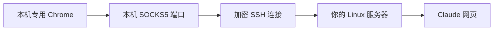

# claude-trans

在 Windows 上双击打开 Claude 网页，并让这个专用 Chrome 窗口通过你自己的 Linux 服务器联网。第一次填写配置、让 Windows 记住密钥口令后，日常只需双击 `3-打开Claude.bat`。

[下载最新版](https://github.com/RickSugarsoul/claude-trans/releases/latest) · [常见问题](docs/TROUBLESHOOTING.md)

浏览器仍运行在你的电脑上，服务器负责转发网页连接。服务器无需安装桌面、浏览器或 Claude Code。本项目是个人工具，与 Anthropic、Google 或云服务商无隶属关系。



## 开始前准备

- 本机：Windows 10 / 11、Windows PowerShell 5.1、Windows OpenSSH 客户端、Google Chrome。
- 服务器：你有权使用的 Linux 服务器；本机能连接它的 SSH 端口，且服务器允许 SSH 端口转发并能访问目标网站。
- 登录材料：服务器地址、SSH 用户名，以及对应的 SSH **私钥文件**。

如果你已有可用的 SSH 密钥，直接进入下一节。如果没有，先看文末的[准备 SSH 密钥](#准备-ssh-密钥)。Workbench 能一键连接服务器，并不代表你的电脑已经拥有 SSH 登录密钥。

## 第一次使用

### 1. 解压并填写配置

把整个文件夹解压到固定位置，不要直接从 ZIP 内运行。双击 `1-配置.bat`：它会在首次使用时从 `config.example.json` 生成 `config.json`，然后用记事本打开。

填写 `Server`、`User`、`PrivateKeyPath` 三项，其他项目通常保持默认。示例中的服务器和用户名是占位符，必须换成你自己的值：

```json
{
  "Server": "your-server.example.com",
  "User": "your-user",
  "PrivateKeyPath": "%USERPROFILE%/.ssh/claude_trans",
  "SshPort": 22,
  "LocalSocksPort": 1080,
  "ChromePath": "",
  "ChromeProfilePath": "%LOCALAPPDATA%/ClaudeTrans/ChromeProfile",
  "ConnectTimeoutSeconds": 180
}
```

保存后关闭记事本。`config.json` 是你自己的本机配置，已被 Git 忽略；不要分享给其他人。

| 配置项 | 如何填写 |
| --- | --- |
| `Server` | 必填：服务器公网 IP 或域名，不带 `https://`、用户名或端口。 |
| `User` | 必填：实际 SSH 登录的 Linux 用户名。 |
| `PrivateKeyPath` | 必填：本机私钥文件路径，不是 `.pub` 文件，也不是口令。支持 `%USERPROFILE%`。 |
| `SshPort` | 服务器 SSH 端口，默认 `22`；若改过端口，按实际填写。 |
| `LocalSocksPort` | 本机代理端口，默认 `1080`。被占用时，程序会在随后 20 个端口中尝试空闲端口；也可手动修改。 |
| `ChromePath` | 默认空字符串，由程序查找 Chrome；找不到时填写 `chrome.exe` 的完整路径。 |
| `ChromeProfilePath` | 专用 Chrome 的数据目录，默认在当前 Windows 用户的本地应用数据目录下。不要指向日常 Chrome 的数据目录。 |
| `ConnectTimeoutSeconds` | 建立中转时的等待上限，默认 `180` 秒。 |

**Windows 路径在 JSON 中建议用 `/`。** 例如 `C:/Keys/server_key`；若使用反斜杠，需要写成 `C:\\Keys\\server_key`。不要把 PowerShell 的 `$env:USERPROFILE` 写进 JSON，使用上例中的 `%USERPROFILE%`。

私钥文件名不要求固定后缀。用 `ssh-keygen` 生成时，`claude_trans` 通常是私钥，`claude_trans.pub` 是公钥。修改 `.pub` 的后缀不能把公钥变成私钥。

### 2. 让 Windows 记住密钥口令

双击 `2-记住密钥口令.bat`，按提示完成设置。首次启用 Windows 的 `ssh-agent` 服务可能出现管理员确认窗口。

如果提示 `Enter passphrase for ...`，输入**生成这把私钥时设置的口令**。输入时不显示字符是正常现象。它与服务器账号密码、Claude 账号密码不是一回事。

工具通过 Windows `ssh-agent` 使用已解锁的密钥，不把口令写进 `config.json`。添加成功后，在同一 Windows 账号下通常无需每次重新输入；换电脑、换 Windows 账号或密钥被移除后，需要再次运行这一步。[Windows OpenSSH 密钥管理说明](https://learn.microsoft.com/en-us/windows-server/administration/openssh/openssh_keymanagement)

### 3. 打开 Claude

双击 `3-打开Claude.bat`。首次 SSH 连接可能询问服务器指纹；通过服务器控制台核对后，再按提示输入 `yes`。工具不会关闭服务器身份校验。

连接成功后会打开专用 Chrome 窗口并访问 [Claude 网页版](https://claude.ai)。在网页里登录自己的 Claude 账号即可。这个窗口有独立的 Cookie 和登录记录，首次使用需要登录。

使用期间保留启动器窗口，可以最小化。**关闭所有专用 Chrome 窗口后，本次 SSH 中转会自动结束。** 工具不会主动关闭你的其他 Chrome 或 SSH 会话。网络中断后，先关闭专用 Chrome，再重新双击启动。

## 日常使用

1. 双击 `3-打开Claude.bat`。
2. 在打开的专用 Chrome 中使用网页。
3. 用完关闭所有专用 Chrome 窗口。

日常 Chrome 和专用 Chrome 可以同时存在，但使用中转时请在脚本打开的窗口里访问。不要反复启动同一个专用浏览器目录。

## 准备 SSH 密钥

### 检查现有私钥

如果以前连接时用过 `ssh -i "某个路径" ...`，`-i` 后面的路径就是私钥位置。以下命令仅检查一个示例位置是否存在，不显示私钥内容；如文件名不同，请改为原来的文件名：

```powershell
Test-Path "$env:USERPROFILE\.ssh\claude_trans"
```

确认文件后，可在本机 PowerShell 验证登录。把示例服务器、用户名和端口改为自己的值：

```powershell
ssh -i "$env:USERPROFILE\.ssh\claude_trans" -o IdentitiesOnly=yes -p 22 -l your-user your-server.example.com whoami
```

输出预期的 Linux 用户名，说明该密钥能登录此账号。若只知道私钥口令、找不到私钥文件，口令本身不能代替私钥；请查找原文件或重新生成密钥并授权。

### 没有密钥时生成一把

在本机普通 PowerShell 中执行：

```powershell
New-Item -ItemType Directory -Force "$env:USERPROFILE\.ssh" | Out-Null
ssh-keygen -t ed25519 -f "$env:USERPROFILE\.ssh\claude_trans" -C "claude-trans"
```

若提示文件已存在，不要覆盖已有密钥；使用另一文件名，并同步修改配置。按提示设置口令，然后查看**公钥**：

```powershell
Get-Content "$env:USERPROFILE\.ssh\claude_trans.pub"
```

复制输出的整行 `ssh-ed25519 ...`，不要复制私钥。

通过你已经能用的 Workbench、云控制台或 SSH 会话进入服务器，执行 `whoami` 确认当前用户。公钥必须放入 `config.json` 中 `User` 指定的账号。如果当前用户不同，请先通过已有权限切换到目标账号，例如 `sudo -iu your-user`，再次用 `whoami` 确认。

**以下命令在目标 Linux 用户的服务器终端运行：**

```bash
mkdir -p ~/.ssh
chmod 700 ~/.ssh
touch ~/.ssh/authorized_keys
chmod 600 ~/.ssh/authorized_keys
nano ~/.ssh/authorized_keys
```

在文件末尾另起一行粘贴完整公钥，保留已有内容。Nano 中按 `Ctrl+O`、回车保存，再按 `Ctrl+X` 退出。若没有 Nano，使用服务器已有的文本编辑器。

回到本机，用上一节的 `ssh ... whoami` 命令验证。这个过程无需开启服务器密码认证。

## 没有 OpenSSH 客户端

在本机 PowerShell 执行 `ssh -V`。若提示找不到命令，可从 Windows“可选功能”安装 **OpenSSH 客户端**；也可在管理员 PowerShell 执行：

```powershell
Add-WindowsCapability -Online -Name OpenSSH.Client~~~~0.0.1.0
```

完成后重新打开终端。本机只需客户端。[微软安装说明](https://learn.microsoft.com/en-us/windows-server/administration/openssh/openssh_install_firstuse)

## 范围与限制

- 本项目打开的是 Claude 网页，不提供 Claude Code、API、中转 API 账号或额外套餐权益。
- 服务器只是网页连接的出口。SSH 接通不代表网站一定允许该出口 IP；Cloudflare 验证、账号资格和网站访问限制仍由网站决定。
- 使用 Chrome 的 SOCKS5 参数转发网页 HTTP/HTTPS 连接，并通过代理解析这些网址的域名。脚本限制 QUIC 与 WebRTC 的非代理 UDP 使用，但这不是全机 VPN，也不保证浏览器扩展或所有组件的网络行为。[Chromium SOCKS 说明](https://www.chromium.org/developers/design-documents/network-stack/socks-proxy/)
- 本机 SOCKS 端口只监听 `127.0.0.1`。服务器通常只需允许你连接 SSH 端口，无需对公网开放 `1080` 或远程桌面端口。
- 自动监测专用 Chrome 使用 Windows 窗口机制，未来 Chrome 行为变化可能需要更新脚本。不同 Windows、Chrome 和服务器环境仍需实际验证。

## 文件说明与排错

| 文件 | 用途 |
| --- | --- |
| `1-配置.bat` | 创建或编辑本机配置。 |
| `2-记住密钥口令.bat` | 配置密钥代理并添加私钥。 |
| `3-打开Claude.bat` | 建立中转并打开专用 Chrome。 |
| `config.example.json` | 可公开分享的空配置模板。 |
| `config.json` | 用户自己的配置，不进入 Git。 |
| `config.ps1` / `edit-config.ps1` | 配置读取、检查和编辑。 |
| `remember-key.ps1` / `claude-via-server.ps1` | 密钥设置和启动逻辑。 |
| `browser.ps1` | 检测指定数据目录的 Chrome 是否运行。 |
| `docs/TROUBLESHOOTING.md` | 常见问题与处理方法。 |

出现问题时，先看[常见问题](docs/TROUBLESHOOTING.md)。分享错误信息前请去掉个人 IP、用户名、文件路径；不要分享私钥、口令、浏览器登录数据或完整个人配置。

## 开发与打包

在源码目录用 Windows PowerShell 5.1 运行：

```powershell
powershell -NoProfile -ExecutionPolicy Bypass -File ./tests/run.ps1
powershell -NoProfile -ExecutionPolicy Bypass -File ./build-release.ps1
```

测试使用临时文件、回环 TCP 监听和测试消息窗口，覆盖配置保护、参数传递、SOCKS 检测、端口归属及浏览器识别；不使用真实私钥，不连接真实服务器。这些本地测试不能代替实际 SSH 登录和 Claude 网页访问验证。

打包脚本只包含明确列出的公开文件，生成 `dist/claude-trans-v1.0.0.zip` 和 SHA-256 文件。不会把 `config.json`、私钥、浏览器目录或旧备份加入 ZIP。不要把自己的整个安装目录直接上传。

代码使用 [MIT License](LICENSE)。
